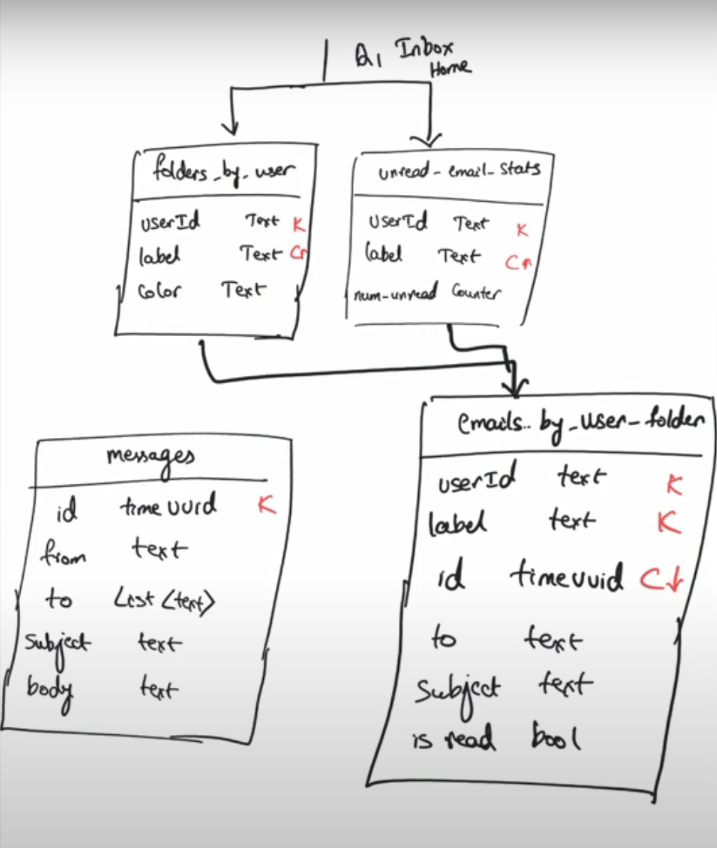

# InboxApp
InboxApp using SpringBoot + Cassandra

# Requirements
Similar to any Email App but not using any SMTP Server. More of messages to internal users.
Authentication Done using Github OAuth

# How to Setup and Run
1. You need to setup the connection to Cassandra DB hosted on DataStax Astra
	- Create a database through DataStax Astra console with keyspace-name as "main"
	- Go to the database page and generate a token selecting an apt user role.
	- Once you create a token put the following values from the token into the application.yml file
		- spring.data.cassandra.username = Client Id
		- spring.data.cassandra.password = Client Secret
		- astra.db.id = databaseId found on the database page
		- astra.db.region = region you selected while creating the database instance
		- astra.db.application.token = Token value generated.
	- Download the bundle from database(inbox-app) -> Connect -> Drivers -> Select Java -> Download Bundle
	  and save it in the location src\main\resources
2. Generate ClientID and Client Secret from GitHub and update the values in application.yml file
   Refer this -> https://episyche.com/blog/how-to-create-oauth-client-id-and-client-secret-for-github
3. Build and Run the project.

Functional Requirements
1. Compose a message
2. Send a message
3. View a message
4. Folder / Label Organization 
   1. Inbox 
   2. Sent 
   3. User Folders
5. Reply and Reply All
6. View all messages
7. Attachments

Non Functional Requirements
1. High availability
2. High scalability
3. Authentication and Authorization

# TechStack

1. SpringBoot - Application Tire
2. ThymeLeaf - FrontEnd Tire
3. Cassandra - Database Tire
4. Spring Security - Security Tire

# Logical Data Model

# Physical Data Model

