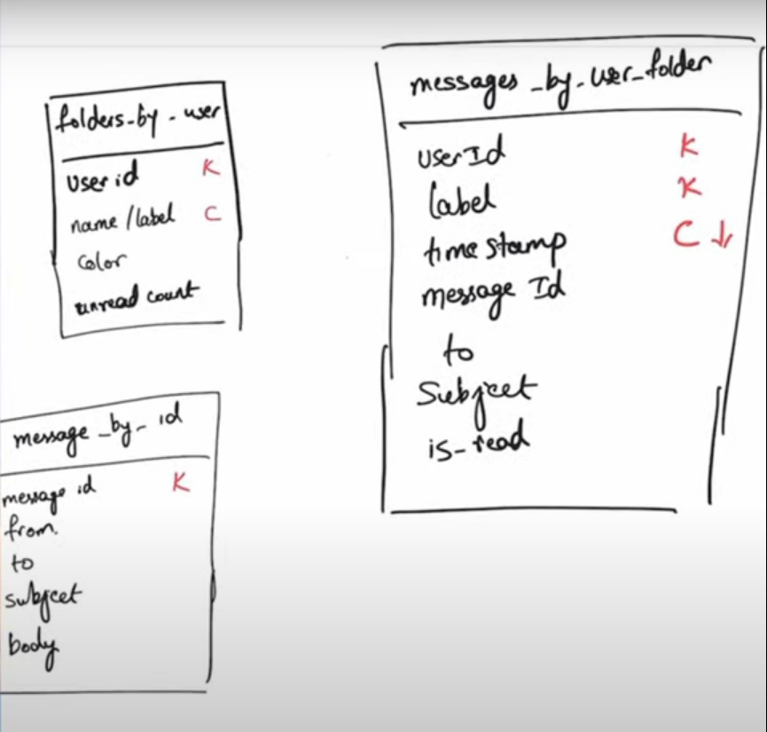
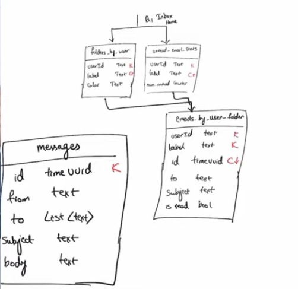

# InboxApp
InboxApp using SpringBoot + Cassandra
# Requirements
Similar to any Email App but not using any SMTP Server. More of messages to internal users.

Functional Requirements
1. Compose a message
2. Send a message
3. View a message
4. Folder / Label Organization 
   1. Inbox 
   2. Sent 
   3. User Folders
5. Reply and Reply All
6. View all messages
7. _Attachments (TODO)_

Non Functional Requirements
1. High availability
2. High scalability
3. Authentication and Authorization

# TechStack

1. SpringBoot - Application Tire
2. ThymeLeaf - FrontEnd Tire
3. Cassandra - Database Tire
4. Spring Security - Security Tire

# Logical Data Model

# Physical Data Model

